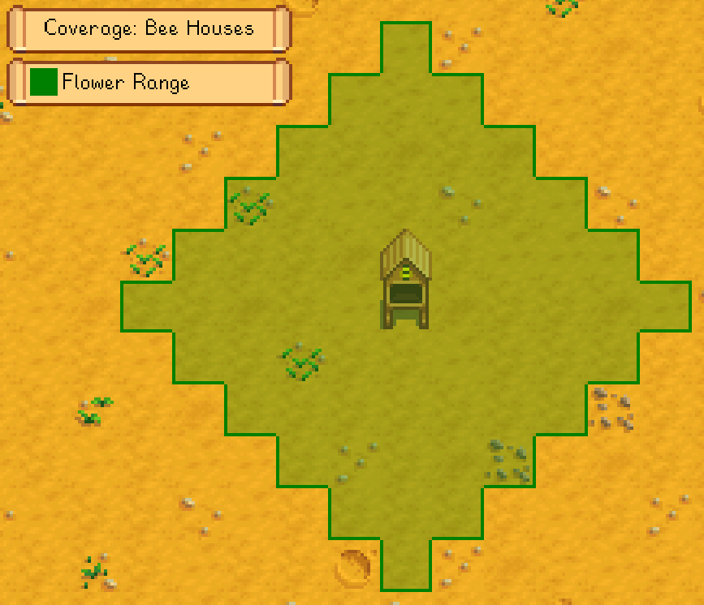
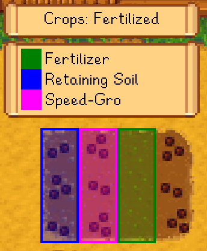

**Data Layers** is a [Stardew Valley](http://stardewvalley.net/) mod that overlays the world with
visual data like accessibility, bee/Junimo/scarecrow/sprinkler coverage, etc. It automatically
includes data from other mods if applicable.

## Contents
* [Install](#install)
* [Use](#use)
* [Configure](#configure)
* [Compatibility](#compatibility)
* [See also](#see-also)

## Install
1. [Install the latest version of SMAPI](https://smapi.io/).
2. [Install this mod from Nexus mods](https://www.nexusmods.com/stardewvalley/mods/1691).
3. Run the game using SMAPI.

## Use
Press `F2` to show the overlay, and then `left CTRL` and `right CTRL` to cycle between layers
(buttons configurable).

For coverage layers (e.g. scarecrows or sprinklers), point at one with the cursor to see a blue
border around that one's range and a green border around the coverage without it.

Below are the current data layers.

### Accessibility
Shows where you can walk and highlights warp tiles; useful for finding hidden paths and nooks.
> 

### Coverage: bee houses
Shows bee houses' flower search range. (The weird shape isn't a bug, that's the game's
actual range.)
> 

### Coverage: Junimo huts
Shows Junimo hut coverage, and highlights crops they won't reach. Also works when placing a Junimo
hut from the Wizard's build menu.
> 

### Coverage: scarecrows
Shows scarecrow coverage, and highlights unprotected crops. Also works on scarecrows being placed.
> 

### Coverage: sprinklers
Shows sprinkler coverage, and highlights unsprinkled crops. Also works on sprinklers being placed.
> 

### Crops: ready for harvest
Shows which crops are ready to harvest, or which won't be ready before they die due to a season
change.
> 

### Crops: fertilised
Shows which crops have fertiliser applied.
> 

### Crops: watered
Shows which crops have been watered today.
> 

## Configure
The mod creates a `config.json` file in its mod folder the first time you run it. You can open that
file in a text editor to configure the mod.

These are the available settings:

setting    | what it affects
---------- | -------------------
`Controls` | The configured controller, keyboard, and mouse buttons (see [key bindings](https://stardewvalleywiki.com/Modding:Key_bindings)). You can separate multiple buttons with commas. The default values are `F2` to toggle the overlay, left `CTRL` or left controller shoulder for the previous layer, and right `CTRL` or right controller shoulder for the next one.
`Layers`   | For each data layer, configure... <ul><li>`Enabled`: whether it should be available in-game.</li><li>`UpdatesPerSecond`: how often the layer should update. The maximum is 60 per seconds, but can be less than 1 to update less than once per second (or zero to disable the data layer entirely).</li><li>`UpdateWhenViewChange`: Whether to update when your viewpoint in the game changes, regardless of the `UpdatesPerSecond` value.</li></ul>
`CombineOverlappingBorders` | Default `true`. When two groups of the same color overlap, draw one border around their edges instead of their individual borders.

## Compatibility
Data Layers is compatible with Stardew Valley 1.3+ on Linux/Mac/Windows, both single-player and
multiplayer. There are no known issues in multiplayer (even if other players don't have it
installed).

Data Layers will automatically integrate with these mods if you they're installed:

mod installed     | effects
----------------- | ----------
Better Junimos    | Shows custom Junimo hut range.
Better Sprinklers | Shows custom sprinkler range.
Cobalt            | Shows cobalt sprinkler range.
Pelican Fiber     | Shows coverage when building a Junimo hut or sprinkler through Pelican Fiber's menu.
Prismatic Tools   | Shows prismatic sprinkler range.
Simple Sprinkler  | Shows custom sprinkler range.

## See also
* [Release notes](release-notes.md)
* [Nexus mod](https://www.nexusmods.com/stardewvalley/mods/1691)
* [Discussion thread](https://community.playstarbound.com/threads/data-layers.139625/)
